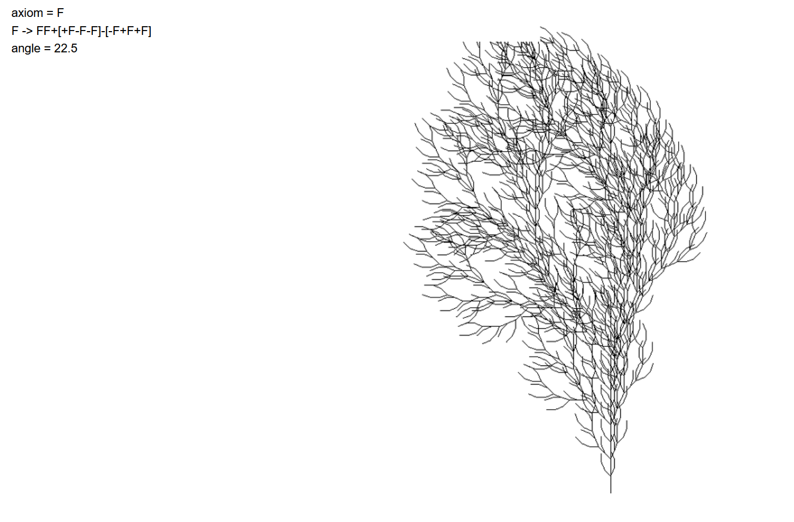
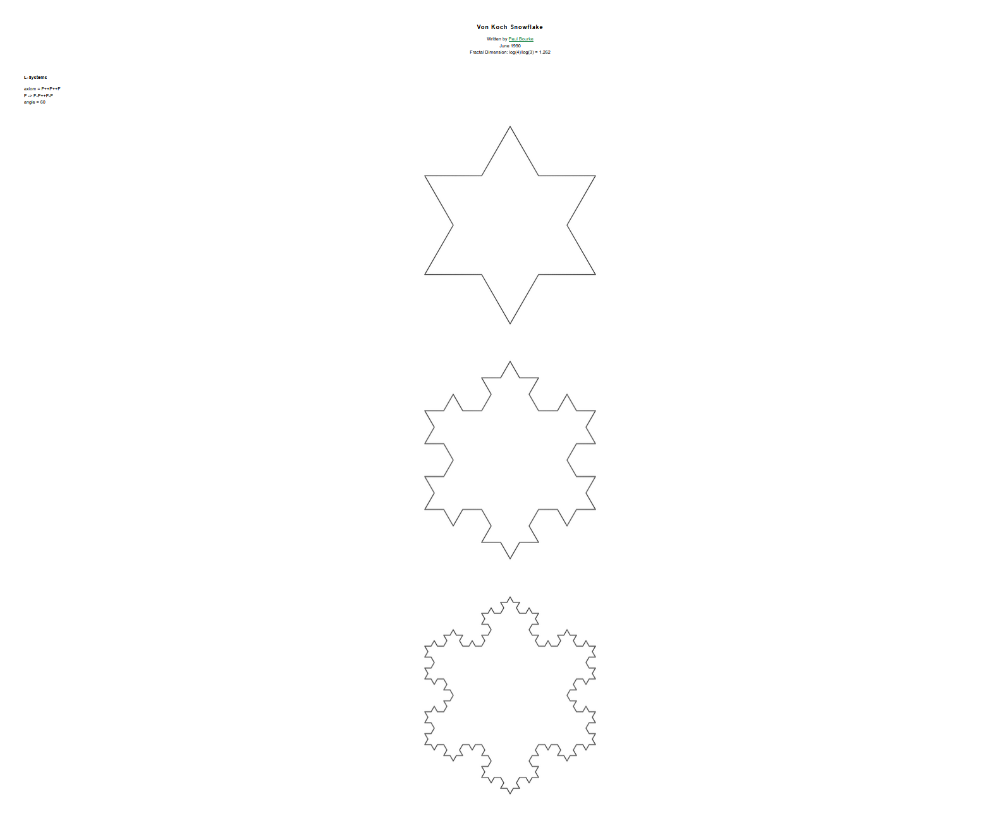

# L-Systems

This repository is for Research into Lindenmayer Systems (L-Systems) to
simulate plant growth algorithmcally. The goal is to implement an L-Systems
model to be able to render them 3 dimansionally.

## Sources

**Here is a list of papers and resources to learn about L-Systems:**

- [The Flowering of String Rewriting Systems](https://www.tandfonline.com/doi/epdf/10.1080/07468342.1992.11973463?needAccess=true)
- [The Algorithmic Beauty of Plants](https://algorithmicbotany.org/papers/abop/abop.pdf)
- [L Systems : Creating Plants from Simple Rules - Computerphile](https://youtu.be/puwhf-404Xc?si=Pz6ax7lGY5Fyilyy)
- [Examples of L-Systems](https://paulbourke.net/fractals/lsys/)

```Turtle interpretation of symbols
F Move foreward and draw a line.
f Move foreward without drawing a line
+ Turn left.
- Turn right.
^ Pitch up.
& Pitch down.
\ Roll left.
/ Roll right.
| Turn around.
$ Rotate the turtle to vertical.
[ Start a branch.
] Complete a branch.
{ Start a polygon.
G Move foreward and draw a line. Do not record a vertex.
. Record a vertex in the current polygon.
} Complete a polygon.
~ Incorporate a predefined surface.
! Decrement the diameter of segments.
` Increment the current color index.
% Cut off the remainder of the branch.
```

We can implement these systems by simply interpreting each character to be an
action that the turtle will draw to the screen.

### Overview

Lindenmayer Systems, or L-Systems, are a type of formal grammar introduced by
biologist Aristid Lindenmayer in 1968 to model the growth processes of plants
and other organisms. An L-System consists of an alphabet of symbols, a
starting string called the axiom, and a set of production rules that describe
how each symbol should be replaced or rewritten in each generation. By
repeatedly applying these rules, complex patterns emerge from simple beginnings,
making L-Systems a powerful tool for simulating natural growth and recursive
structures.



One classic example is the Koch snowflake. Starting with a straight line (the
axiom), the rule “replace each line segment with four smaller segments forming
a triangular bump” is applied iteratively. After just a few iterations, the
shape evolves into a fractal snowflake with infinite perimeter but finite area
. Another well-known example is the fractal tree, where the axiom is a single
trunk, and production rules describe how branches split and grow at certain
angles. With each iteration, the structure becomes more tree-like, visually
approximating real plant growth.



Beyond mathematics and computer graphics, L-Systems have practical
applications in biology, procedural content generation, and art. In biology,
they help model how algae or plants develop over time. In computer graphics,
they are used to generate realistic trees, vines, and other vegetation for
films and video games. Artists and designers also use them to create intricate
fractal patterns or generative artwork. Overall, L-Systems provide a simple
yet powerful framework for exploring how complexity can arise from recursive,
rule-based processes.

DOL Systems (Deterministic Context-Free L-Systems) are a specific type of L-System
where each symbol in the alphabet has exactly one production rule associated
with it.


